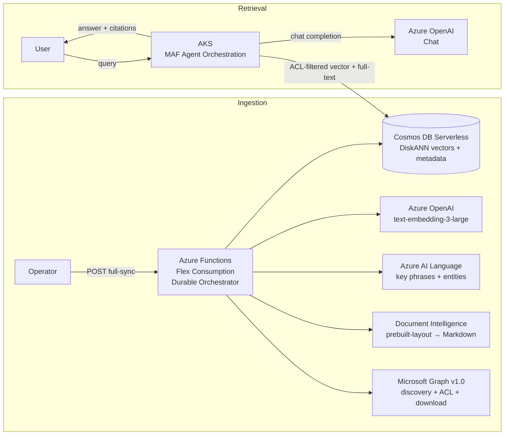
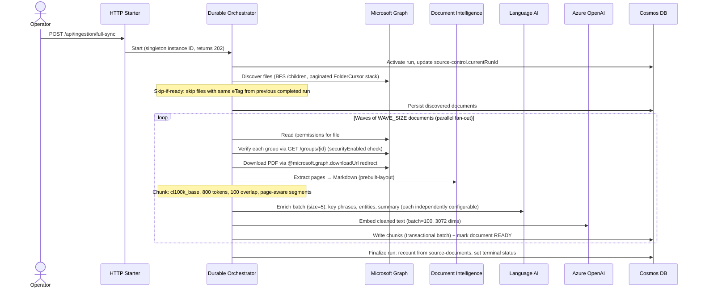
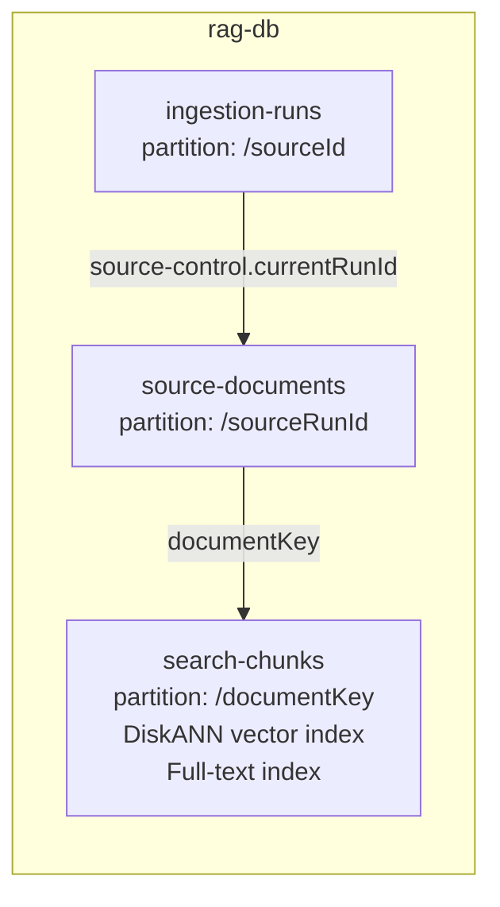
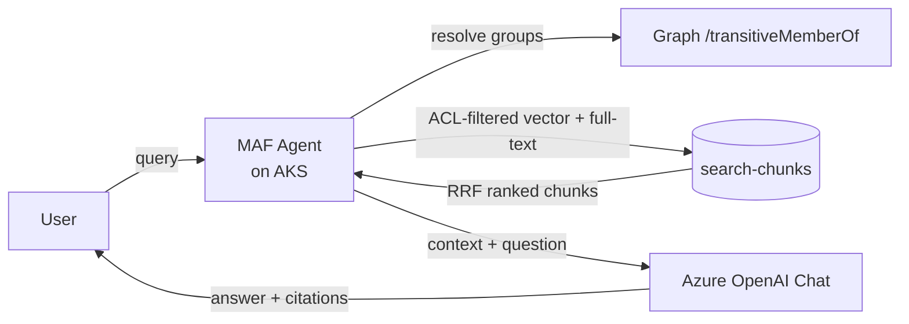
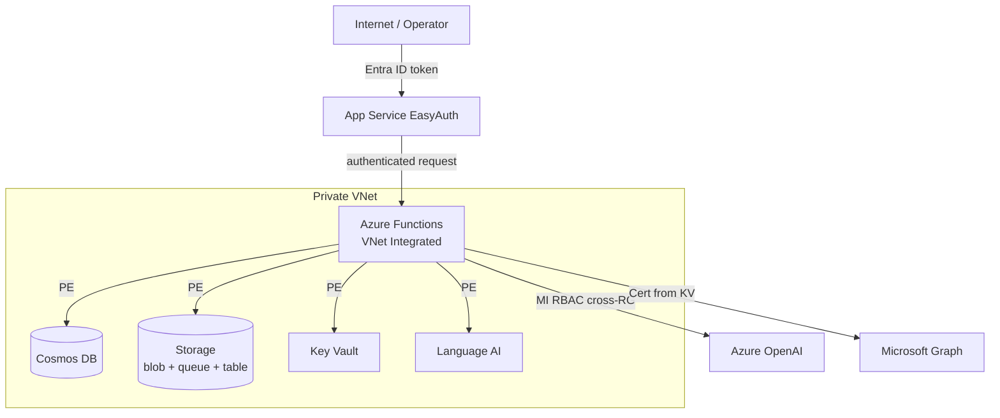

# Architecture

## System Overview

## API Endpoints

| Method | Route | Purpose |
|--------|-------|---------|
| POST | `/api/ingestion/full-sync` | Start durable full-sync orchestrator (singleton, returns 202) |
| GET | `/api/ingestion/status` | Query orchestration instance status and output |
| POST | `/api/ingestion/terminate` | Terminate a stuck orchestration and purge history |
| GET | `/api/ingestion/inspect` | Read Cosmos containers for debugging (limit 50) |

Retrieval is served by the MAF agent on AKS (not the Function App).

All endpoints use `AuthLevel.ANONYMOUS` — protected by App Service Authentication (Entra ID).

## Ingestion Flow

## Authentication Model

| Component | Method | Credentials |
|-----------|--------|-------------|
| Microsoft Graph | Certificate-based `CertificateCredential` | PFX from Key Vault secret |
| Cosmos DB, Doc Intelligence, Language AI | Managed Identity (`DefaultAzureCredential`) | User-assigned MI |
| Azure OpenAI | MI token provider (`get_bearer_token_provider`) | `cognitiveservices.azure.com` scope |
| Operator endpoints | App Service EasyAuth | Entra ID app registration |
| Retrieval (query-time) | EasyAuth claims + Graph `/transitiveMemberOf` | Caller's Entra token |

Graph app registration requires: `Sites.Selected`, `GroupMember.Read.All` (application permissions).

## Security Model

1. Discovery finds all files matching configured extensions (BFS traversal)
2. ACL verification reads `/permissions` for each file, extracts `grantedToV2`/`grantedToIdentitiesV2` group IDs
3. Each group is verified via `GET /groups/{id}?$select=securityEnabled` — accepted if `securityEnabled=true` or if Graph returns 404 (app may lack Group.Read.All)
4. Sharing links → FAILED (rejected). No Entra groups found → FAILED (never retrievable)
5. Retrieval requires: caller's transitive security groups ∩ document's `allowedGroupIds` ≠ ∅
6. Only documents with `status=ready` in the current run are searchable

## Data Model (Cosmos DB) — Schema v1

### ingestion-runs (partition: /sourceId)
- **source-control**: singleton pointer to `currentRunId`, `lastCompletedRunId`
- **run records**: `ingestionMode`, status, stage, counters, `ProfileSnapshot` (extraction/chunking/enrichment/embedding config), timestamps

### source-documents (partition: /sourceRunId)
- One record per discovered file per run
- Tracks: status, stage, ACL (`allowedGroupIds`, `aclHash`), `eTag`, `contentHash`, attempt count, processing timestamps
- Composite index: `[status ASC, discoveryOrdinal ASC]`

### search-chunks (partition: /documentKey)
- One record per chunk with: content, embedding (3072-dim), ACL, enrichment status per module, key phrases, entities
- Citation fields: `sourceName`, `sourceUrl`, `pageStart`, `pageEnd`, `sectionPath`
- DiskANN vector index on `/embedding` (cosine, 3072 dims)
- Full-text index on `/content` (language: en-US)
- ACL index on `/allowedGroupIds/[]`

## Retrieval Architecture

- **Runtime**: Microsoft Agent Framework (MAF) on AKS
- **ACL enforcement**: Agent resolves caller's transitive security groups, injects into Cosmos query
- **Retrieval modes**: `HYBRID` (default, RRF of vector + full-text), `VECTOR` only, `FULL_TEXT` only
- **Direct Cosmos access**: Agent queries `search-chunks` container using SDK with MI credentials

## Error Classification

All services classify errors into two categories that drive retry behavior:

| Error Type | Python Exception | Durable Behavior | Examples |
|-----------|-----------------|------------------|----------|
| Retryable | `TimeoutError` | Retried up to 5× by Durable | 429 throttling, API timeouts, transient 5xx |
| Terminal | `TerminalDocumentError` | Document marked FAILED immediately | Invalid PDF, no pages, no ACL groups, sharing links |

## Configurable Modules

| Module | Env Var | Default | Effect when disabled |
|---|---|---|---|
| Document Intelligence | `EXTRACTION_ENABLED` | `true` | Documents fail (no extraction alternative) |
| Key Phrases (Language AI) | `KEY_PHRASES_ENABLED` | `true` | Chunks stored without key phrases |
| Entities (Language AI) | `ENTITIES_ENABLED` | `true` | Chunks stored without named entities |
| Summary (Language AI) | `SUMMARY_ENABLED` | `false` | Chunks stored without abstractive summary |
| File Type Filter | `ALLOWED_FILE_EXTENSIONS` | `.pdf` | Only matching files discovered |
| Wave Parallelism | `WAVE_SIZE` | `4` | Number of documents processed in parallel per wave |

## Scale Limits (hardcoded in `ScaleLimits`)

| Limit | Value |
|-------|-------|
| Max eligible PDFs per run | 10,000 |
| Max drive items scanned | 50,000 |
| Max folders traversed | 10,000 |
| Max folder depth | 32 |
| Max Graph pages | 20,000 |
| Max PDF size | 25 MB |
| Max PDF pages | 500 |
| Max chunks per PDF | 2,000 |

## Retry Strategy

| Layer | Mechanism | Configuration |
|-------|-----------|---------------|
| Durable activity | Built-in retry | 5 attempts, 5s initial backoff (exponential) |
| Graph HTTP transport | `httpx.HTTPTransport(retries=3)` | Transport-level retry on connection errors |
| Cosmos 429 throttling | Repository exponential backoff | 5 retries, 1s × 2^n delay |
| Cosmos ETag conflicts | Repository conditional replace | 3 conflict retries |
| OpenAI/DI 429 | Mapped to `TimeoutError` → Durable retry | Classified at service boundary |

## Idempotent Re-Runs (Skip-if-Ready)

Full-sync is safe to re-run. On each discovery, the pipeline checks the previous completed run:
- If a file has `status=READY` and the same `eTag` (content unchanged) → **skipped**
- If a file is new, modified, or previously failed → **processed**

Re-running full-sync after transient failures only reprocesses the failed files, not the entire corpus.

## Deployment

- **Runtime**: Azure Functions Flex Consumption, Python 3.12
- **Orchestration**: Durable Task Scheduler (MI-based auth), task hub `full-sync`
- **Function timeout**: 30 minutes (`host.json`)
- **IaC**: Bicep via `azd provision` / `azd deploy`
- **Networking**: VNet-integrated with Private Endpoints for Cosmos, Storage, Key Vault, Language AI

## Network Security

- **Zero public access to backend services** — Cosmos, Storage, Key Vault, and Language AI are accessible only via Private Endpoints inside the VNet
- **Zero secrets in code or config** — all auth via Managed Identity (auto-rotated tokens) or Key Vault certificate (loaded at runtime)
- **Single public surface** — only the Function App is internet-facing, gated by EasyAuth (Entra ID OAuth 2.0)
- **Cross-RG access** — Azure OpenAI in a separate resource group, accessed via MI RBAC role (`Cognitive Services OpenAI User`)
- **Graph egress over public internet** — Microsoft Graph does not support Private Endpoints (multi-tenant global service). Calls to `graph.microsoft.com` egress via VNet's internet gateway over TLS 1.2 with certificate-based auth.
