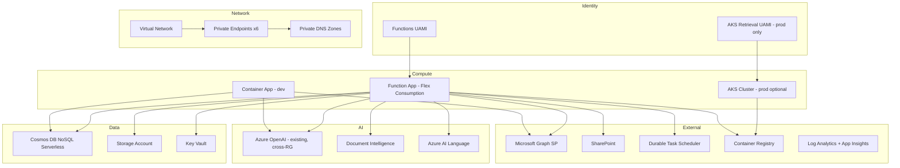

# Azure Resource, Permissions, and Network Inventory

Evidence-based inventory of every Azure service, SKU, RBAC role assignment, app registration, and network component provisioned by this repository's Bicep IaC (`infra/`). Every entry cites the exact source file/line it was verified against — nothing here is inferred or estimated.

## 1. Architecture Overview

## 2. Azure Services — SKU and Properties

| Service | Resource Type | SKU / Tier | Key Properties | Source |
|---|---|---|---|---|
| **Function App** | `Microsoft.Web/sites` | Linux, kind `functionapp,linux` | Flex Consumption runtime `python 3.12`, `instanceMemoryMB` 512-4096 (default 2048), `maximumInstanceCount` 40-1000, `alwaysReady: http x1`, `httpsOnly: true`, `minTlsVersion: 1.2`, `publicNetworkAccess: Enabled`, VNet-integrated | [functions.bicep L124-136, L349-365](../infra/modules/functions.bicep) |
| **Function App plan** | `Microsoft.Web/serverfarms` | **FC1 / FlexConsumption** | `reserved: true` (Linux) | [functions.bicep L124-133](../infra/modules/functions.bicep) |
| **Cosmos DB account** | `Microsoft.DocumentDB/databaseAccounts` | **Serverless** (default) or Provisioned | `consistencyPolicy: Session`, `enableAutomaticFailover: false`, `isVirtualNetworkFilterEnabled: true`, `publicNetworkAccess: Disabled`, `disableLocalAuth: true`, capabilities `EnableNoSQLVectorSearch` + `EnableNoSQLFullTextSearch` | [cosmos.bicep L24-49](../infra/modules/cosmos.bicep) |
| ↳ `ingestion-runs` container | — | — | Partition key `/sourceId` | [cosmos.bicep L84](../infra/modules/cosmos.bicep) |
| ↳ `source-documents` container | — | — | Partition key `/sourceRunId` | [cosmos.bicep L114](../infra/modules/cosmos.bicep) |
| ↳ `search-chunks` container | — | Autoscale max 1000 RU/s (provisioned mode) | Partition key `/documentKey`; `diskANN` vector index on `/embedding` (3072-dim, float32, cosine); full-text index `en-US` on `content`+`searchableText` | [cosmos.bicep L156-234](../infra/modules/cosmos.bicep) |
| ↳ `service-audit` container | — | — | Partition key `/id`; `defaultTtl: 7776000` (90 days) | [cosmos.bicep L239-260](../infra/modules/cosmos.bicep) |
| **Storage Account** | `Microsoft.Storage/storageAccounts` | **StorageV2, Standard_ZRS** (configurable LRS/ZRS/GRS) | `minimumTlsVersion: TLS1_2`, `allowBlobPublicAccess: false`, `allowSharedKeyAccess: false`, `supportsHttpsTrafficOnly: true`, `publicNetworkAccess: Disabled`, blob soft-delete 7 days | [storage.bicep L25-51](../infra/modules/storage.bicep) |
| ↳ `app-package` container | — | Private | Flex Consumption deployment package | [storage.bicep L79-85](../infra/modules/storage.bicep) |
| **Key Vault** | `Microsoft.KeyVault/vaults` | **Standard (family A)** | `enableRbacAuthorization: true`, soft-delete 90 days, **purge protection enabled** (module default), `publicNetworkAccess: Disabled`, `networkAcls.defaultAction: Deny` (bypass AzureServices) | [keyvault.bicep L30-51](../infra/modules/keyvault.bicep) |
| **Document Intelligence** | `Microsoft.CognitiveServices/accounts` kind `FormRecognizer` | **S0** (or F0 dev) | `publicNetworkAccess: Disabled`, `disableLocalAuth: true`, `networkAcls.defaultAction: Deny` | [ai-services.bicep L29-45](../infra/modules/ai-services.bicep) |
| **Azure AI Language** | `Microsoft.CognitiveServices/accounts` kind `TextAnalytics` | **S** (or F0 dev) | Same network/auth posture as above | [ai-services.bicep L52-68](../infra/modules/ai-services.bicep) |
| **Azure OpenAI** | `Microsoft.CognitiveServices/accounts` (existing, cross-RG) | Not provisioned here — referenced by name | Deployments used: `text-embedding-3-large` (3072 dim), chat deployment (name param) | [main.bicep L15-19](../infra/main.bicep) |
| **Durable Task Scheduler** | `Microsoft.DurableTask/schedulers` | **Consumption** | `ipAllowlist: [0.0.0.0/0]` (public, MI-authenticated) | [durable-task.bicep L18-27](../infra/modules/durable-task.bicep) |
| ↳ Task hub | `Microsoft.DurableTask/schedulers/taskHubs` | — | Named `{sourceId}-sync` | [durable-task.bicep L31-34](../infra/modules/durable-task.bicep) |
| **Container Registry (ACR)** | `Microsoft.ContainerRegistry/registries` | **Basic** | `adminUserEnabled: false` (MI-based pull only) | [acr.bicep L18-27](../infra/modules/acr.bicep) |
| **Container App (ACA, dev)** | `Microsoft.App/containerApps` | — | `0.5 vCPU / 1Gi` per replica, `minReplicas: 1`, `maxReplicas: 5`, ingress external, target port 8080, liveness/readiness probes | [aca.bicep L59-105](../infra/modules/aca.bicep) |
| ↳ ACA managed environment | `Microsoft.App/managedEnvironments` | — | `vnetConfiguration.internal: true` (VNet-internal only), Log Analytics destination | [aca.bicep L27-40](../infra/modules/aca.bicep) |
| **AKS (prod optional, `deployAks=true`)** | `Microsoft.ContainerService/managedClusters` | — | K8s **1.30**, `enableRBAC: true`, Azure CNI Overlay + Calico network policy, OIDC issuer enabled, Workload Identity enabled, Container Insights (omsagent), API server VNet integration | [aks.bicep L31-89](../infra/modules/aks.bicep) |
| ↳ System node pool | — | **Standard_D2s_v5** | count 2, autoscale 2-4, AzureLinux | [aks.bicep L52-63](../infra/modules/aks.bicep) |
| ↳ User node pool | — | **Standard_D4s_v5** | count 2, autoscale 2-10, AzureLinux | [aks.bicep L64-75](../infra/modules/aks.bicep) |
| **Log Analytics Workspace** | `Microsoft.OperationalInsights/workspaces` | **PerGB2018** | Retention 90 days (30-730 configurable) | [monitoring.bicep L30-39](../infra/modules/monitoring.bicep) |
| **Application Insights** | `Microsoft.Insights/components` | kind `web` | `DisableLocalAuth: true`, `IngestionMode: LogAnalytics`, daily cap configurable (-1 = unlimited) | [monitoring.bicep L42-53](../infra/modules/monitoring.bicep) |
| **Virtual Network** | `Microsoft.Network/virtualNetworks` (AVM module) | — | `10.20.0.0/22` | [networking.bicep L20-45](../infra/modules/networking.bicep) |
| **Managed Identity (Functions)** | `Microsoft.ManagedIdentity/userAssignedIdentities` | — | User-assigned, shared by Function App + ACA (dev) | [identity.bicep L20-24](../infra/modules/identity.bicep) |
| **Managed Identity (AKS retrieval, prod)** | `Microsoft.ManagedIdentity/userAssignedIdentities` | — | Federated credential for Workload Identity | [aks-identity.bicep L45-52](../infra/modules/aks-identity.bicep) |

## 3. Permissions / RBAC Role Assignments

### 3.1 Functions Managed Identity (`rbac.bicep`, `openai-rbac.bicep`, `graph-rbac.bicep`, `durable-task.bicep`)

| Role | Role ID | Scope | Source |
|---|---|---|---|
| Cosmos DB Built-in Data Contributor | `00000000-0000-0000-0000-000000000002` | Cosmos account (full DB) | [rbac.bicep L44-51](../infra/modules/rbac.bicep) |
| Storage Blob Data Owner | `b7e6dc6d-f1e8-4753-8033-0f276bb0955b` | Storage account | [rbac.bicep L53-60](../infra/modules/rbac.bicep) |
| Storage Queue Data Contributor | `974c5e8b-45b9-4653-ba55-5f855dd0fb88` | Storage account | [rbac.bicep L62-71](../infra/modules/rbac.bicep) |
| Storage Table Data Contributor | `0a9a7e1f-b9d0-4cc4-a60d-0319b160aaa3` | Storage account | [rbac.bicep L73-82](../infra/modules/rbac.bicep) |
| Key Vault Secrets User | `4633458b-17de-408a-b874-0445c86b69e6` | Key Vault | [rbac.bicep L84-91](../infra/modules/rbac.bicep) |
| Cognitive Services User | `a97b65f3-24c7-4388-baec-2e87135dc908` | Document Intelligence | [rbac.bicep L93-100](../infra/modules/rbac.bicep) |
| Cognitive Services User | `a97b65f3-24c7-4388-baec-2e87135dc908` | Azure AI Language | [rbac.bicep L102-109](../infra/modules/rbac.bicep) |
| Monitoring Metrics Publisher | `3913510d-42f4-4e42-8a64-420c390055eb` | Application Insights | [rbac.bicep L111-120](../infra/modules/rbac.bicep) |
| Cognitive Services OpenAI User | `5e0bd9bd-7b93-4f28-af87-19fc36ad61bd` | Azure OpenAI (**cross-resource-group** scope) | [openai-rbac.bicep L14-23](../infra/modules/openai-rbac.bicep) |
| Durable Task Data Contributor | `0ad04412-c4d5-4796-b79c-f76d14c8d402` | Durable Task Hub | [durable-task.bicep L37-46](../infra/modules/durable-task.bicep) |
| Microsoft Graph app role: `GroupMember.Read.All` | `98830695-27a2-44f7-8c18-0c3ebc9698f6` | Graph SP (tenant) | [graph-rbac.bicep L16-20](../infra/modules/graph-rbac.bicep) |
| Microsoft Graph app role: `User.Read.All` | `df021288-bdef-4463-88db-98f22de89214` | Graph SP (tenant) | [graph-rbac.bicep L22-26](../infra/modules/graph-rbac.bicep) |
| ACR Pull | `7f951dda-4ed3-4680-a7ca-43fe172d538d` | ACR (if `appIdentityPrincipalId` set) | [acr.bicep L44-51](../infra/modules/acr.bicep) |

**Total Functions MI role assignments verified: 12** (excluding conditional ACR pull).

### 3.2 AKS Retrieval Managed Identity (prod only, `aks-identity.bicep`)

| Role | Scope | Notes |
|---|---|---|
| Cosmos DB Built-in Data **Reader** (`00000000-0000-0000-0000-000000000001`) | Full Cosmos account | Read-only — narrower than Functions MI |
| Cosmos DB Built-in Data **Contributor** (`00000000-0000-0000-0000-000000000002`) | Scoped **only** to `service-audit` container | Deliberate least-privilege: retrieval can write audit but not chunks/documents |
| Cognitive Services OpenAI User | Cross-RG Azure OpenAI | Via nested `openai-rbac-aks.bicep` module |
| Microsoft Graph `GroupMember.Read.All` | Graph SP | Same as Functions |
| Microsoft Graph `User.Read.All` | Graph SP | Same as Functions |

### 3.3 ACR Kubelet Identity (AKS only)

| Role | Scope |
|---|---|
| ACR Pull | ACR (via `kubeletPrincipalId`) — separate from the workload identity so image pull and data-plane access remain isolated |

## 4. App Registrations / Entra Identities

These are **external inputs** to Bicep (`param`) — the Entra app registrations are created **outside** this IaC (manually or via a separate script); Bicep only wires their IDs into resource configuration.

| App Registration | Parameter | Purpose | Source |
|---|---|---|---|
| **SharePoint app registration** | `sharePointAppClientId` | Certificate-based Graph access for SharePoint ingestion (drive read, delta query, webhooks) | [main.bicep L27, functions.bicep L92](../infra/main.bicep) |
| **Admin/Query API app registration** | `adminApiClientId` | EasyAuth v2 identity provider for the Function App — `registration.clientId`, audience `api://{adminApiClientId}` | [functions.bicep L397-406](../infra/modules/functions.bicep) |
| **Allowed caller app IDs** | `allowedApplicationClientIds` (array) | EasyAuth `defaultAuthorizationPolicy.allowedApplications` — restricts which client apps can call the Function API. **Empty by default** (dev posture — any tenant app can call) | [functions.bicep L405, main.bicep L48](../infra/main.bicep) |
| **Microsoft Graph Service Principal** | `graphServicePrincipalId` | Well-known Graph SP object ID (tenant-specific) — target of app role assignments | [main.bicep L52](../infra/main.bicep) |

> **Known gap (carried over from application code review)**: `allowedApplicationClientIds` defaults to `[]`, meaning any application in the tenant can obtain a token and call the Function App's endpoints, including destructive ones (`/api/ingestion/purge`, `/api/ingestion/terminate`). Per-endpoint role checks (`require_easy_auth_role`) exist in code but are not invoked from `function_app.py`. See production readiness backlog.

## 5. Function App Authentication Configuration (EasyAuth v2)

| Setting | Value | Source |
|---|---|---|
| Platform | Enabled, runtime `~1` | [functions.bicep L379-382](../infra/modules/functions.bicep) |
| `requireAuthentication` | `true` | [functions.bicep L387](../infra/modules/functions.bicep) |
| `unauthenticatedClientAction` | `Return401` | [functions.bicep L388](../infra/modules/functions.bicep) |
| Excluded paths | `/api/webhook/*` (Graph webhooks use `clientState` instead of EasyAuth) | [functions.bicep L389-391](../infra/modules/functions.bicep) |
| Identity provider | Azure AD, `openIdIssuer`: `{tenant}/v2.0` | [functions.bicep L393-397](../infra/modules/functions.bicep) |
| Allowed audience | `api://{adminApiClientId}` | [functions.bicep L399-401](../infra/modules/functions.bicep) |
| `requireHttps` | `true` | [functions.bicep L410-412](../infra/modules/functions.bicep) |

## 6. Network Configuration

### 6.1 Virtual Network — `10.20.0.0/22`

| Subnet | CIDR | Delegation | Purpose |
|---|---|---|---|
| `function-integration` | `10.20.0.0/27` | `Microsoft.App/environments` | Function App VNet integration (Flex Consumption) |
| `private-endpoints` | `10.20.0.32/27` | none (PE network policies disabled) | Hosts all 6 private endpoints |
| `aca-environment` | `10.20.2.0/23` | `Microsoft.App/environments` | ACA managed environment (VNet-**internal**) |
| `aks-nodes` (AKS only) | `10.20.0.64/26` | none | AKS node pools |

### 6.2 Private Endpoints (6 total)

| Target | Group ID | Private DNS Zone |
|---|---|---|
| Storage — Blob | `blob` | `privatelink.blob.core.windows.net` |
| Storage — Queue | `queue` | `privatelink.queue.core.windows.net` |
| Storage — Table | `table` | `privatelink.table.core.windows.net` |
| Cosmos DB | `Sql` | `privatelink.documents.azure.com` |
| Key Vault | `vault` | `privatelink.vaultcore.azure.net` |
| Document Intelligence | `account` | `privatelink.cognitiveservices.azure.com` |
| Azure AI Language | `account` | `privatelink.cognitiveservices.azure.com` (shared zone, deduplicated) |

Deduplication logic: `union(map(privateEndpointTargets, target => target.dnsZoneName), [])` — since Document Intelligence and Language share the same DNS zone, only one zone resource is created. [networking.bicep L17-18](../infra/modules/networking.bicep)

### 6.3 Public Network Access Posture (per service)

| Service | Public access | Notes |
|---|---|---|
| Storage | **Disabled** | Private endpoint only |
| Cosmos DB | **Disabled** | Private endpoint only, `isVirtualNetworkFilterEnabled: true` |
| Key Vault | **Disabled** | Private endpoint only, bypass `AzureServices` |
| Document Intelligence | **Disabled** | Private endpoint only |
| Azure AI Language | **Disabled** | Private endpoint only |
| Function App | **Enabled** (with EasyAuth gate) | Public HTTPS endpoint, VNet-integrated egress |
| ACA environment | N/A (`internal: true`) | VNet-internal only — not publicly resolvable |
| Durable Task Scheduler | Public, `ipAllowlist: [0.0.0.0/0]` | Auth via Managed Identity, not IP restriction |
| Log Analytics / App Insights | **Enabled** (ingestion + query) | No private endpoint configured |
| ACR | Not explicitly restricted in Bicep (`adminUserEnabled: false` only) | No private endpoint configured for ACR |

### 6.4 AKS Network Profile (prod only)

| Setting | Value |
|---|---|
| Network plugin | `azure` (Azure CNI) |
| Plugin mode | `overlay` |
| Network policy | `calico` |
| Service CIDR | `10.100.0.0/16` |
| DNS service IP | `10.100.0.10` |
| Pod CIDR | `10.244.0.0/16` |
| API server access | VNet-integrated, restricted to `aks-nodes` subnet |

## 7. Decoupling Assessment

| Aspect | Verdict |
|---|---|
| Two separate managed identities (Functions vs AKS retrieval) | Good — enforces least privilege; retrieval MI cannot write to search-chunks |
| Cosmos permission scoping (Reader for AKS MI vs Contributor for Functions MI) | Good — deliberate separation of ingestion (write) vs retrieval (read) |
| ACR pull separated from data-plane access (kubelet vs workload identity) | Good — matches AKS best practice (image pull is not app permissions) |
| EasyAuth `allowedApplications` defaults to empty | Known gap — any tenant app can call. Documented, not yet remediated. |
| Cosmos, Storage, KV, Cognitive Services all fully private | Good — strong network isolation |
| Function App is publicly reachable | Necessary for HTTP triggers/webhooks, mitigated by EasyAuth + `excludedPaths` for webhook-specific `clientState` auth |
| ACR has no private endpoint | Minor gap — image pulls traverse public internet (mitigated by `adminUserEnabled: false` + Entra-based AcrPull) |
| Durable Task Scheduler has `ipAllowlist: [0.0.0.0/0]` | Public, but auth is Managed Identity-based, not network-based, by design of the Durable Task Scheduler connection model |

## 8. Risks

| # | Risk | Evidence | Severity |
|---|---|---|---|
| R1 | Function App admin/destructive endpoints lack per-endpoint role check despite EasyAuth | `require_easy_auth_role` exists in `app/retrieval/auth.py` but is unused in `function_app.py` | High |
| R2 | `allowedApplicationClientIds` defaults to `[]` | [main.bicep L48](../infra/main.bicep) | Medium — any tenant app can call the Function API by default |
| R3 | ACR has no private endpoint | No PE reference in [acr.bicep](../infra/modules/acr.bicep) | Low — mitigated by disabled admin user + RBAC-only pull |
| R4 | Log Analytics / App Insights allow public ingestion and query | [monitoring.bicep L34-35, L48-49](../infra/modules/monitoring.bicep) | Low — standard for telemetry; no sensitive data logged by default |

## 9. Required Validation

- [ ] Confirm the Entra app registrations for `sharePointAppClientId` and `adminApiClientId` exist and have correct API permissions granted (Graph `GroupMember.Read.All`, `User.Read.All`, `Sites.Selected` or equivalent for SharePoint) — Bicep only wires IDs, it does not create or verify the app registration itself.
- [ ] Confirm `allowedApplicationClientIds` is populated for any non-dev deployment.
- [ ] Confirm ACR does not need a private endpoint per your security baseline (currently relies on RBAC only).

## 10. References

- [MS Learn — Azure Functions Flex Consumption plan](https://learn.microsoft.com/azure/azure-functions/flex-consumption-plan)
- [MS Learn — Cosmos DB RBAC built-in role definitions](https://learn.microsoft.com/azure/cosmos-db/how-to-setup-rbac)
- [MS Learn — App Service authentication and authorization (EasyAuth v2)](https://learn.microsoft.com/azure/app-service/overview-authentication-authorization)
- [MS Learn — AKS Workload Identity](https://learn.microsoft.com/azure/aks/workload-identity-overview)
- [MS Learn — Azure Private Link for PaaS services](https://learn.microsoft.com/azure/private-link/private-endpoint-overview)
- [MS Learn — Durable Task Scheduler](https://learn.microsoft.com/azure/azure-functions/durable/durable-task-scheduler/durable-task-scheduler)
