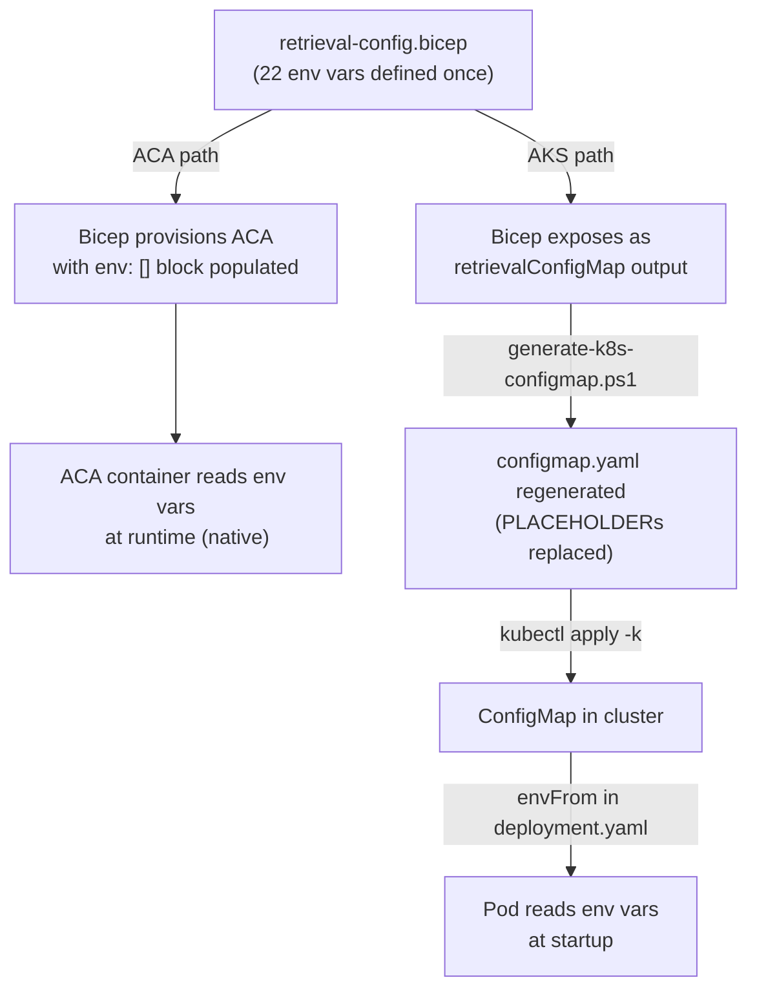

# Azure Setup Guide

Complete setup instructions for the Enterprise RAG Pipeline. Follow these steps in order — each section depends on the previous one.

## Prerequisites

Install these tools before starting:

| Tool | Version | Install |
|---|---|---|
| Azure CLI | 2.60+ | `winget install Microsoft.AzureCLI` |
| PowerShell | 7+ | `winget install Microsoft.PowerShell` |
| Python | 3.12+ | `winget install Python.Python.3.12` |
| Azure Functions Core Tools | 4.x | `npm install -g azure-functions-core-tools@4` |

**Azure permissions required:**
- Owner or Contributor on the target subscription
- Application Administrator in Entra ID (for app registrations)

```powershell
# Verify you're logged in
az login
az account show --query "{subscription:name, user:user.name}" -o table
```

---

## Part 1: One-Time Azure Resource Setup

### 1.1 Create Resource Group

```powershell
az group create --name rg-rag-project --location eastus2
```

### 1.2 Create Azure OpenAI Resource and Deploy Models

```powershell
# Create OpenAI resource (or use existing)
az cognitiveservices account create `
  --name <openai-account-name> `
  --resource-group <openai-resource-group> `
  --kind OpenAI `
  --sku S0 `
  --location eastus2

# Deploy embedding model
az cognitiveservices account deployment create `
  --name <openai-account-name> `
  --resource-group <openai-resource-group> `
  --deployment-name text-embedding-3-large `
  --model-name text-embedding-3-large `
  --model-version "1" `
  --model-format OpenAI `
  --sku-capacity 120 `
  --sku-name Standard

# Deploy chat model
az cognitiveservices account deployment create `
  --name <openai-account-name> `
  --resource-group <openai-resource-group> `
  --deployment-name <chat-deployment-name> `
  --model-name <model-name> `
  --model-version "<version>" `
  --model-format OpenAI `
  --sku-capacity 80 `
  --sku-name Standard
```

Save these values:
- `AZURE_OPENAI_ACCOUNT_NAME` = the account name
- `AZURE_OPENAI_RESOURCE_GROUP` = the resource group
- `OPENAI_EMBEDDING_DEPLOYMENT_NAME` = `text-embedding-3-large`
- `OPENAI_CHAT_DEPLOYMENT_NAME` = your chat deployment name

### 1.3 Prepare SharePoint Site

1. Create a SharePoint site (or use existing): `https://<tenant>.sharepoint.com/sites/<site-name>`
2. Create a document library (e.g., "Policies")
3. Upload test PDF files to the library
4. Create Entra security groups for access control:
   - E.g., `SharePoint Editors` (Edit) and `SharePoint Readers` (Read)
   - Add them at **Site Settings → Site Permissions** as direct Domain Group grants
   - Ensure the document library **inherits permissions** from the site (default)
   - If the library has unique permissions, click "Delete unique permissions" to restore inheritance
5. Find the drive ID:
   - Open Graph Explorer: https://developer.microsoft.com/graph/graph-explorer
   - Query: `GET https://graph.microsoft.com/v1.0/sites/<site-id>/drives`
   - Copy the `id` field of your document library's drive

Save: `SHAREPOINT_ASSIGNED_DRIVE_ID` (looks like `b!J4-sjvEAhkCVc8...`)

### 1.4 Create Entra App Registration (Graph API Access)

```powershell
# Create the app
$app = az ad app create `
  --display-name "RAG-SharePoint-Ingestion" `
  --sign-in-audience AzureADMyOrg `
  --query "{appId:appId, id:id}" -o json | ConvertFrom-Json

Write-Host "App Client ID: $($app.appId)"

# Grant Microsoft Graph application permissions
$graphAppId = "00000003-0000-0000-c000-000000000000"

# Files.Read.All
az ad app permission add --id $app.appId `
  --api $graphAppId `
  --api-permissions "df021288-bdef-4463-88db-98f22de89214=Role"

# Sites.Read.All
az ad app permission add --id $app.appId `
  --api $graphAppId `
  --api-permissions "01d4f6a1-cbc3-44db-832a-4ab4cfb6c8b3=Role"

# GroupMember.Read.All
az ad app permission add --id $app.appId `
  --api $graphAppId `
  --api-permissions "98830695-27a2-44f7-8c18-0c3ebc9698f6=Role"

# User.Read.All
az ad app permission add --id $app.appId `
  --api $graphAppId `
  --api-permissions "df021288-bdef-4463-88db-98f22de89214=Role"

# Sites.Selected (Graph)
az ad app permission add --id $app.appId `
  --api $graphAppId `
  --api-permissions "883ea226-0bf2-4a8f-9f9d-92c9162a727d=Role"

# --- SharePoint API permissions (separate from Graph) ---
$spAppId = "00000003-0000-0ff1-ce00-000000000000"

# Sites.Read.All (SharePoint)
az ad app permission add --id $app.appId `
  --api $spAppId `
  --api-permissions "d13f72ca-a275-4b96-b789-48ebcc4da984=Role"

# Grant admin consent for all permissions
az ad app permission admin-consent --id $app.appId
```

> **Important:** The SharePoint `Sites.Read.All` permission is under a DIFFERENT API (`00000003-0000-0ff1-ce00-000000000000`) from Graph's `Sites.Read.All`. Both are required: Graph for `driveItem/permissions`, SharePoint for `/_api/web/sitegroups` site group member resolution.

Save: `SHAREPOINT_APP_CLIENT_ID` = the appId

### 1.5 Create Certificate for Graph Authentication

The app authenticates to Microsoft Graph using a certificate (more secure than client secrets).

```powershell
# Create self-signed certificate (valid 2 years)
$cert = New-SelfSignedCertificate `
  -Subject "CN=RAG-SharePoint-Graph-Auth" `
  -CertStoreLocation "Cert:\CurrentUser\My" `
  -KeyExportPolicy Exportable `
  -KeySpec Signature `
  -KeyLength 2048 `
  -KeyAlgorithm RSA `
  -HashAlgorithm SHA256 `
  -NotAfter (Get-Date).AddYears(2)

Write-Host "Thumbprint: $($cert.Thumbprint)"
Write-Host "Expires: $($cert.NotAfter)"

# Export public key for app registration
Export-Certificate -Cert $cert -FilePath "./sharepoint-graph-cert.cer"

# Upload public key to the Entra App Registration
az ad app credential reset --id $app.appId --cert @sharepoint-graph-cert.cer --append
```

### 1.6 Upload Certificate to Key Vault

After infrastructure is deployed (Step 2.2), the Key Vault has a private endpoint. To upload the cert, you must temporarily enable public access.

**Important:** The PFX must be exported WITHOUT a password — `CertificateCredential` cannot deserialize password-protected PFX.

```powershell
$kvName = "<your-keyvault-name>"  # From Bicep deployment output
$kvId = "/subscriptions/<sub-id>/resourceGroups/rg-rag-project/providers/Microsoft.KeyVault/vaults/$kvName"

# Step 1: Delete the private endpoint (PE blocks public access)
az network private-endpoint delete `
  --name "<prefix>-vnet-key-vault-pe" `
  --resource-group rg-rag-project

# Step 2: Enable public access
az keyvault update --name $kvName --resource-group rg-rag-project `
  --public-network-access Enabled --default-action Allow
Start-Sleep 10

# Step 3: Grant yourself write access
$userId = (az ad signed-in-user show --query id -o tsv)
az role assignment create --role "Key Vault Secrets Officer" `
  --assignee $userId --scope $kvId
Start-Sleep 20  # Wait for RBAC propagation

# Step 4: Export passwordless PFX and upload
$pfxBytes = $cert.Export([System.Security.Cryptography.X509Certificates.X509ContentType]::Pfx)
$base64 = [System.Convert]::ToBase64String($pfxBytes)
az keyvault secret set --vault-name $kvName `
  --name "sharepoint-app-cert" --value $base64 `
  --content-type "application/x-pkcs12"

# Step 5: Re-lock
az keyvault update --name $kvName --resource-group rg-rag-project `
  --public-network-access Disabled --default-action Deny

# Step 6: Redeploy Bicep to re-create the private endpoint
az deployment group create --resource-group rg-rag-project `
  --template-file infra/main.bicep `
  --parameters infra/main.parameters.dev.bicepparam
```

> **Note:** If an Azure Policy blocks enabling public access, you may need to add a temporary policy exemption or use a policy bypass tag specific to your organization before Step 2.

### 1.7 Create Admin API App Registration (Easy Auth)

This protects the Function App HTTP endpoints.

```powershell
$adminApp = az ad app create `
  --display-name "RAG-Admin-API" `
  --sign-in-audience AzureADMyOrg `
  --query "{appId:appId}" -o json | ConvertFrom-Json

# Set identifier URI
az ad app update --id $adminApp.appId `
  --identifier-uris "api://$($adminApp.appId)"

Write-Host "Admin API Client ID: $($adminApp.appId)"
```

Save: `ADMIN_API_CLIENT_ID` = the appId

### 1.8 Get Graph Service Principal ID

```powershell
$graphSpId = az ad sp show --id 00000003-0000-0000-c000-000000000000 --query id -o tsv
Write-Host "Graph SP ID: $graphSpId"
```

Save: `GRAPH_SERVICE_PRINCIPAL_ID` = the ID

### 1.9 Generate Webhook Secret

```powershell
$webhookSecret = python -c "import secrets; print(secrets.token_urlsafe(32))"
Write-Host "Webhook Secret: $webhookSecret"
```

Save: `WEBHOOK_CLIENT_STATE` = the generated secret

---

## Part 2: Deploy and Run

### Quick-Start: Deploy to Existing Infrastructure

If the Azure infrastructure (AKS, VNet, Cosmos DB, Key Vault, etc.) is already provisioned, follow this condensed flow:

```
Step 1  →  Clone repo & install tools
Step 2  →  Create 2 Entra app registrations (Steps 1.4 + 1.7)
Step 3  →  Create certificate & upload to Key Vault (Steps 1.5 + 1.6)
Step 4  →  Configure .env file (Step 2.1)
Step 5  →  Deploy Bicep (creates Function App + RBAC + remaining resources)
Step 6  →  Deploy Function App code
Step 7  →  Build & deploy retrieval container to AKS
Step 8  →  Run full sync + activate webhook
Step 9  →  Validate (E2E test runbook)
```

**What you need from the existing infrastructure:**

| Item | Where to find it | Used in |
|---|---|---|
| AKS cluster name | `az aks list --query "[].name"` | Step 7 |
| ACR login server | `az acr list --query "[].loginServer"` | Step 7 |
| Key Vault name | `az keyvault list --query "[].name"` | Step 1.6 |
| Cosmos DB account name | `az cosmosdb list --query "[].name"` | Bicep param |
| VNet name + subnet IDs | `az network vnet list` | Bicep param |
| Azure OpenAI endpoint | `az cognitiveservices account list --kind OpenAI` | `.env` file |
| Subscription ID | `az account show --query id` | `.env` file |
| Tenant ID | `az account show --query tenantId` | `.env` file |

**What Bicep creates (even with existing infra):**

| Resource | Why it's always created |
|---|---|
| Function App (Flex Consumption) | Ingestion pipeline — no existing equivalent |
| Durable Task Scheduler | Orchestration state — Function App-specific |
| RBAC role assignments | Grants managed identity access to existing resources |
| Private endpoints | Secures existing resources inside VNet |
| App Insights | Telemetry for the pipeline |

**What Bicep skips if already exists:**

The Bicep templates use `existing` references for resources you provide as parameters (OpenAI account, AKS cluster). It only creates what's missing. Review `infra/main.parameters.dev.bicepparam` and override parameters for existing resources.

### 2.1 Configure Environment Variables

Create `.azure/rag-project/.env`:

```
ADMIN_API_CLIENT_ID="<from 1.7>"
AZURE_ENV_NAME="rag-project"
AZURE_LOCATION="eastus2"
AZURE_OPENAI_ACCOUNT_NAME="<from 1.2>"
AZURE_OPENAI_RESOURCE_GROUP="<from 1.2>"
GRAPH_SERVICE_PRINCIPAL_ID="<from 1.8>"
INGESTION_SOURCE_ID="sharepoint-drive"
OPENAI_CHAT_DEPLOYMENT_NAME="<from 1.2>"
OPENAI_EMBEDDING_DEPLOYMENT_NAME="text-embedding-3-large"
SHAREPOINT_APP_CLIENT_ID="<from 1.4>"
SHAREPOINT_ASSIGNED_DRIVE_ID="<from 1.3>"
SHAREPOINT_CERTIFICATE_SECRET_NAME="sharepoint-app-cert"
SHAREPOINT_TENANT_ID="<your Entra tenant ID>"
SHAREPOINT_SITE_URL="https://<tenant>.sharepoint.com/sites/<site-name>"
WEBHOOK_CLIENT_STATE="<from 1.9>"
```

> **`SHAREPOINT_SITE_URL`** enables resolution of Entra security groups nested inside SharePoint site groups. If omitted, only direct Entra SG grants on the library are captured.

See `README.md` for the full environment variable reference.

### 2.2 Deploy Infrastructure (Bicep)

```powershell
# Load env vars
Get-Content .azure/rag-project/.env | ForEach-Object {
  if ($_ -match '^([^=]+)="?([^"]*)"?$') {
    [Environment]::SetEnvironmentVariable($matches[1], $matches[2], 'Process')
  }
}

# Deploy
az deployment group create `
  --resource-group rg-rag-project `
  --template-file infra/main.bicep `
  --parameters infra/main.parameters.dev.bicepparam
```

This creates: Cosmos DB, Storage, Key Vault, Functions App, Document Intelligence, Language Service, App Insights, VNet, and all RBAC assignments.

#### Deployed Resources

| Resource | Purpose |
|---|---|
| Function App (Flex Consumption) | Ingestion pipeline, webhook receiver, query proxy |
| Container App (ACA) | Retrieval service (FastAPI + agent framework) |
| Cosmos DB NoSQL (serverless) | 4 containers: `ingestion-runs`, `source-documents`, `search-chunks`, `service-audit` |
| Key Vault | Certificate storage for Graph/SharePoint auth |
| Storage Account | Function App deployment, Durable Functions state |
| VNet + 3 subnets | Functions integration, ACA infrastructure, private endpoints |
| Container Registry (ACR) | Retrieval service container images (built via `az acr build`, no local Docker required) |
| Document Intelligence | PDF extraction (prebuilt-layout) |
| AI Language | Key phrase extraction, entity recognition |
| Azure OpenAI (cross-RG) | Embeddings (text-embedding-3-large) + chat completions |
| App Insights + Log Analytics | Telemetry, traces, logs |
| Durable Task Scheduler | Orchestration state for full-sync/delta-sync |

#### RBAC Role Assignments (Managed Identity)

| Resource | Role | Purpose |
|---|---|---|
| Cosmos DB | Data Contributor | Read/write documents and chunks |
| Storage Account | Blob Data Owner | Function deployment, blob access |
| Storage Account | Queue Data Contributor | Durable Functions queues |
| Storage Account | Table Data Contributor | Durable Functions state |
| Key Vault | Secrets User | Read certificate for Graph auth |
| Document Intelligence | Cognitive Services User | PDF extraction |
| AI Language | Cognitive Services User | Key phrases, entities |
| Azure OpenAI | Cognitive Services User | Embeddings + chat |
| App Insights | Monitoring Metrics Publisher | Telemetry |

#### Private Endpoints and DNS

| Service | Private Endpoint | DNS Zone |
|---|---|---|
| Storage (blob) | `{prefix}-vnet-storage-blob-pe` | `privatelink.blob.core.windows.net` |
| Storage (queue) | `{prefix}-vnet-storage-queue-pe` | `privatelink.queue.core.windows.net` |
| Storage (table) | `{prefix}-vnet-storage-table-pe` | `privatelink.table.core.windows.net` |
| Cosmos DB | `{prefix}-vnet-cosmos-sql-pe` | `privatelink.documents.azure.com` |
| Key Vault | `{prefix}-vnet-key-vault-pe` | `privatelink.vaultcore.azure.net` |
| Document Intelligence | `{prefix}-vnet-document-intelligence-pe` | `privatelink.cognitiveservices.azure.com` |
| Language Service | `{prefix}-vnet-language-service-pe` | `privatelink.cognitiveservices.azure.com` |
| ACA Environment | Automatic (internal) | `{env-domain}` via `aca-dns.bicep` |

**After first deployment:** Go back to Step 1.6 to upload the certificate to the newly created Key Vault.

### 2.3 Deploy Function App

```powershell
cd app
func azure functionapp publish <function-app-name> --python
```

The function app name is in the deployment output or: `az functionapp list --resource-group rg-rag-project --query "[0].name" -o tsv`

### 2.4 Deploy Retrieval Service

The retrieval service can be deployed to either ACA (dev) or AKS (prod). Set `deployAks = true` in Bicep parameters for AKS.

#### Env Var Flow: How Retrieval Configuration Reaches the Pod

**Single source of truth**: [infra/modules/retrieval-config.bicep](../infra/modules/retrieval-config.bicep) defines all 22 retrieval env vars in one place. Both ACA and AKS consume it — the delivery mechanism differs.

| Step | ACA path | AKS path |
|---|---|---|
| 1. Bicep computes values | Same file, same values | Same file, same values |
| 2. Delivered to workload as | ACA `containerApp.properties.template.containers[0].env` (auto-set by Bicep) | Bicep deployment output `retrievalConfigMap` (JSON object) |
| 3. Loaded by workload as | Container environment variables (Azure Container Apps native) | Kubernetes ConfigMap → pod via `envFrom: configMapRef` |
| 4. Manual step required? | **No** — one `azd provision` sets everything | **Yes** — run [scripts/generate-k8s-configmap.ps1](../scripts/generate-k8s-configmap.ps1) to regenerate `configmap.yaml` from Bicep outputs before `kubectl apply` |

**Key insight**: Neither ACA nor AKS requires setting env vars manually. For AKS, the "manual step" is a single command that reads Bicep outputs and writes `configmap.yaml`.

**Zero secrets in either path**: All auth (Cosmos, OpenAI, Graph, App Insights) uses Managed Identity. The MI client ID travels through the config, not a secret. AKS additionally uses Workload Identity — the K8s ServiceAccount is federated to the MI, so there are no kubeconfig secrets to manage.



### 2.4.1 Deploy the Retrieval Service

#### Option A: ACA Deployment (default)

```powershell
cd app/retrieval
az acr build --registry <acr-name> --image rag-retrieval:latest . --no-logs

# ACA is deployed by Bicep — to force a new revision:
az containerapp update --name <aca-name> --resource-group rg-rag-project `
  --image <acr-name>.azurecr.io/rag-retrieval:latest
```

`RETRIEVAL_SERVICE_URL` is set automatically by Bicep to the ACA internal FQDN.

#### Option B: AKS Deployment

**Prerequisites:** Set `deployAks = true` in `infra/main.parameters.dev.bicepparam` and redeploy Bicep. This creates a dedicated AKS workload identity with federated credentials and scoped RBAC.

**Step 1: Generate K8s configmap from Bicep outputs**

```powershell
.\scripts\generate-k8s-configmap.ps1 -ResourceGroup rg-rag-project -DeploymentName main
```

**Step 2: Get AKS identity and ACR values**

```powershell
$outputs = az deployment group show --resource-group rg-rag-project --name main `
  --query "properties.outputs.{aksId:aksRetrievalIdentityClientId.value,acr:acrLoginServer.value}" -o json | ConvertFrom-Json
Write-Host "AKS Identity: $($outputs.aksId)"
Write-Host "ACR: $($outputs.acr)"
```

**Step 3: Update K8s manifests**

Edit `app/retrieval/kubernetes/serviceaccount.yaml`:
```yaml
annotations:
  azure.workload.identity/client-id: <aksRetrievalIdentityClientId from Step 2>
```

Edit `app/retrieval/kubernetes/deployment.yaml`:
```yaml
image: <acrLoginServer from Step 2>/rag-retrieval:latest
```

**Step 4: Build container image and deploy**

```powershell
cd app/retrieval
az acr build --registry <acr-name> --image rag-retrieval:latest . --no-logs

az aks get-credentials --resource-group rg-rag-project --name <aks-cluster-name>
kubectl apply -k app/retrieval/kubernetes/
```

**Step 5: Verify pods are running**

```powershell
kubectl get pods -l app=retrieval-agent
kubectl logs -l app=retrieval-agent --tail=20
```

**Step 6: Set Function App retrieval URL to AKS service**

```powershell
az functionapp config appsettings set --name <func-app> --resource-group rg-rag-project `
  --settings "RETRIEVAL_SERVICE_URL=http://retrieval-agent.default.svc.cluster.local"
```

> **Note:** The Function App must be VNet-integrated in the same VNet as AKS (or peered) to reach the ClusterIP service.

**ACA vs AKS comparison:**

| Aspect | ACA | AKS |
|---|---|---|
| Bicep param | `deployAks = false` | `deployAks = true` |
| Identity | Shared Functions MI | Dedicated AKS MI with federated credential |
| Cosmos RBAC | Data Contributor (full) | Data Reader (all) + Contributor (audit only) |
| Config source | `retrieval-config.bicep` → ACA env vars | `retrieval-config.bicep` → `configmap.yaml` via script |
| Scaling | ACA auto-scale | HPA (2-10 replicas, CPU/memory) |
| `RETRIEVAL_SERVICE_URL` | Auto-set by Bicep | Must be set manually to K8s service FQDN |

### 2.5 Run Initial Ingestion

```powershell
$base = "https://<function-app-name>.azurewebsites.net"
$token = (az account get-access-token `
  --resource "api://<ADMIN_API_CLIENT_ID>" --query accessToken -o tsv)
$headers = @{ Authorization = "Bearer $token" }

# Trigger full-sync
Invoke-WebRequest -Uri "$base/api/ingestion/full-sync" `
  -Method POST -Headers $headers

# Monitor progress (poll every 30s)
do {
  Start-Sleep 30
  $r = Invoke-WebRequest -Uri "$base/api/ingestion/status" `
    -Method GET -Headers $headers
  $status = ($r.Content | ConvertFrom-Json).runtimeStatus
  Write-Host "Status: $status"
} while ($status -match "Running|Pending")

# View final result
($r.Content | ConvertFrom-Json).output | ConvertTo-Json
```

### 2.6 Activate Webhook (for real-time sync)

The `subscription_renew_timer` creates the Graph webhook subscription automatically at 02:00 UTC daily. On a fresh deployment (deployed after 02:00), you must trigger it manually:

```powershell
# Get the Function App master key
$masterKey = az functionapp keys list `
  --name <function-app-name> `
  --resource-group rg-rag-project `
  --query "masterKey" -o tsv

# Manually trigger subscription creation
Invoke-WebRequest `
  -Uri "https://<function-app-name>.azurewebsites.net/admin/functions/subscription_renew_timer" `
  -Method POST `
  -Headers @{"x-functions-key"=$masterKey; "Content-Type"="application/json"} `
  -Body '{}'
# Should return 202 Accepted
```

Wait 10-15 seconds, then verify the subscription was created:

```powershell
$token = az account get-access-token `
  --resource "api://<ADMIN_API_CLIENT_ID>" --query accessToken -o tsv
$r = Invoke-RestMethod `
  -Uri "https://<function-app-name>.azurewebsites.net/api/ingestion/inspect?container=ingestion-runs&limit=20" `
  -Headers @{Authorization="Bearer $token"}
$r.rows | Where-Object { $_.id -eq "webhook-subscription" }
# Should show: subscriptionId = <guid>
```

Once active, SharePoint sends change notifications (including permission changes) to `/api/webhook/sharepoint` in near-real-time. To test the endpoint:

```powershell
# Test validation handshake
Invoke-WebRequest `
  -Uri "$base/api/webhook/sharepoint?validationToken=test" `
  -Method POST -ContentType "text/plain" -SkipHttpErrorCheck
# Should return 200 with body "test"
```

> **Note:** The subscription expires after 3 days (Graph maximum for drive resources). The `subscription_renew_timer` (daily 02:00 UTC) renews it automatically. If the Function App is stopped for >3 days, the subscription lapses and will be recreated on next timer fire.

---

## Part 3: Local Development

### 3.1 Set Up Python Environment

```powershell
cd <project-root>
python -m venv .venv
.venv\Scripts\Activate.ps1
pip install -r requirements-dev.txt
pip install -r app/requirements.txt
```

### 3.2 Run Tests

```powershell
python -m pytest tests/ --tb=short
```

### 3.3 Run Function App Locally

```powershell
cd app
func start
```

Requires `local.settings.json` with valid Azure endpoints (uses real cloud services for Cosmos, OpenAI, etc.).

---

## Troubleshooting

### ACL and Permissions Model

The system captures Entra security group IDs during ingestion and enforces them at query time.

**Supported permission paths (in priority order):**

1. **Direct Domain Group grants at site level** — Entra SGs added via Site Settings → Share → Edit/Read. Appear directly in Graph `driveItem/permissions` as `group` identities. Detected in near-real-time: when a webhook fires and delta-sync sees no content changes, the system automatically runs an ACL resync pass.

2. **Entra SGs nested inside SharePoint site groups** — Added to Members/Visitors site groups. Resolved via SharePoint REST API (`/_api/web/sitegroups({id})/users`). Requires `SHAREPOINT_SITE_URL` config and SharePoint `Sites.Read.All` permission.

3. **Library-level direct grants** — SGs granted directly on the document library. Only applies when library has unique permissions (broken inheritance).

**Key constraints:**
- Library should **inherit from site** for consistent behavior
- Graph delta API's `@microsoft.graph.sharedChanged` does NOT fire for library-level permission changes
- When a webhook fires but delta-sync sees no content changes (`itemsSeen=0`), the system automatically triggers an ACL resync pass on all documents — this catches permission-only changes in near-real-time
- Deleted Entra SGs are automatically removed from document ACLs on next ACL resync (Graph returns 404 → SG skipped)
- ACL resync timer (weekly Sun 03:00 UTC) acts as safety net for any missed changes

| Error | Cause | Fix |
|---|---|---|
| `FlagMustBeSetForRestore` on Cognitive Services | Soft-deleted resource from previous deployment | `az cognitiveservices account list-deleted -o table` then `az cognitiveservices account purge --name <name> --resource-group <rg> --location eastus2` |
| `403 Forbidden: readMetadata` on Cosmos | RBAC role assignment missing or not propagated | Re-deploy Bicep (RBAC is always-create now) or wait 5 min |
| `Failed to deserialize certificate in PEM or PKCS12 format` | PFX was exported with a password | Re-export using `.Export([X509ContentType]::Pfx)` (no password) and re-upload |
| `ResourceNotFoundError` for Key Vault secret | Certificate not uploaded to Key Vault | Follow Step 1.6 |
| `ForbiddenByConnection` on Key Vault | Private endpoint blocks CLI/REST access | Delete PE, enable public access, upload cert, disable access, redeploy Bicep (Step 1.6) |
| `400 Bad Request` on Graph drive API | Drive ID has `\!` instead of `!` | Fix in `.env` file: remove the backslash |
| `401 Unauthorized` on ingestion endpoints | Token expired or wrong audience | Re-run `az account get-access-token --resource "api://<CLIENT_ID>"` |
| `429 Too Many Requests` from Graph | Rate limited during ingestion | Wait and retry; reduce `WAVE_SIZE` |
| Webhook returns `403` | Wrong `WEBHOOK_CLIENT_STATE` in request vs app setting | Verify the secret matches in both places |
| `404 Azure Container App - Unavailable` | ACA ingress set to `external: false` or DNS missing | Ensure `external: true` in aca.bicep and aca-dns.bicep creates the private DNS zone |
| ACR build `UnicodeEncodeError` on Windows | Azure CLI colorama encoding bug | Use `--no-logs` flag: `az acr build --no-logs` |
| Delta-sync `graph_delta_reset_required` | Graph delta cursor permanently invalidated (410) | System auto-re-bootstraps cursor; if persistent, check `Prefer` headers include `deltashowsharingchanges` |
| Retrieval 503 after Cosmos container recreation | Missing DiskANN vector/full-text indexes | Redeploy via Bicep: `az deployment group create --template-file infra/modules/cosmos.bicep`; then restart ACA: `az containerapp revision restart` |
| `401 Unauthorized` on SharePoint REST API | App missing SharePoint `Sites.Read.All` permission | Add `Sites.Read.All` under **SharePoint** API (not Graph) in Entra → App Registrations → API permissions |
| ACL resync shows `updated: 0` for permission change | Library has unique (broken) permissions — site changes don't cascade | Restore inheritance: Library Settings → Permissions → Delete unique permissions |
| Deleted Entra SG still in document ACLs | System detects on next ACL resync (404 → skip) | Trigger `acl_resync_timer` or wait for weekly safety net |

---

## Certificate Renewal

The self-signed certificate expires after 2 years. To renew:

1. Create a new certificate (Step 1.5)
2. Upload to Key Vault (Step 1.6) — overwrites the existing secret
3. Upload public key to app registration with `--append` flag
4. The Function App picks up the new cert on next cold start
5. After confirming it works, optionally remove the old cert from the app registration

---

## Security Checklist

- [ ] Key Vault public access is **Disabled** in production
- [ ] No certificates or secrets in source control (`.gitignore` covers `*.pfx`, `*.cer`, `*.pem`)
- [ ] `WEBHOOK_CLIENT_STATE` is a strong random secret (32+ characters)
- [ ] Use CA-signed certificates in production (not self-signed)
- [ ] All service communication uses Managed Identity (no connection strings)
- [ ] Function App Easy Auth blocks unauthenticated access (except webhook paths)

## Post-Deployment Validation

After deployment, validate end-to-end functionality using [docs/E2E_TEST_RUNBOOK.md](E2E_TEST_RUNBOOK.md).

**Quick validation checklist:**

| Step | Command | Expected |
|---|---|---|
| Webhook handshake | `POST /api/webhook/sharepoint?validationToken=test` | 200 + echo |
| Webhook subscription | Inspect `ingestion-runs` for `webhook-subscription` | Record with `subscriptionId` |
| Full sync | `POST /api/ingestion/full-sync` | All PDFs ingested, status=completed |
| Delta add | Upload PDF → wait 30s → check status | `createdOrUpdated >= 1` |
| Delta delete | Delete PDF → wait 30s → check status | `deleted >= 1` |
| ACL resync | Add/remove SG at site → wait 40s | `aclResynced > 0` in delta-sync output |
| Retrieval (standard) | `POST /api/query {"question":"What is MFA?"}` | Simple query → standard path, 200 with answer |
| Retrieval (agentic) | `POST /api/query {"question":"Compare password policy with device policy"}` | Multi-part query → agentic path (auto-routed via query planner), 200 with answer |

---

## Operations and Maintenance

### API Endpoint Reference

All Function App endpoints require an Easy Auth bearer token unless noted.

```powershell
# Get auth token
$token = az account get-access-token --resource "api://<ADMIN_API_CLIENT_ID>" --query accessToken -o tsv
$headers = @{Authorization = "Bearer $token"}
$base = "https://<function-app-name>.azurewebsites.net"
```

#### Ingestion Endpoints

| Method | Endpoint | Auth | Purpose |
|---|---|---|---|
| POST | `/api/ingestion/full-sync` | Bearer token | Start full document ingestion from SharePoint |
| GET | `/api/ingestion/status` | Bearer token | Get orchestration status (full-sync or delta-sync) |
| GET | `/api/ingestion/status?instanceId=<id>` | Bearer token | Get status of a specific orchestration instance |
| POST | `/api/ingestion/terminate` | Bearer token | Terminate a running orchestration |
| POST | `/api/ingestion/retry-failed` | Bearer token | Retry only failed documents from the current run |
| GET | `/api/ingestion/inspect?container=<name>&limit=<n>` | Bearer token | Read rows from any Cosmos container (max 200) |
| DELETE | `/api/ingestion/purge` | Bearer token | Delete items from a Cosmos container (audited) |

**Inspect endpoint containers:** `ingestion-runs`, `source-documents`, `search-chunks`, `service-audit`

```powershell
# Example: Inspect source documents
Invoke-RestMethod -Uri "$base/api/ingestion/inspect?container=source-documents&limit=50" -Headers $headers

# Example: Filter by run ID
Invoke-RestMethod -Uri "$base/api/ingestion/inspect?container=source-documents&runId=20260819T172505Z-abc123&limit=50" -Headers $headers
```

#### Cosmos Data Purge

Delete specific items or purge an entire container's data (preserves container + indexes). Every purge writes an audit record to `service-audit`.

```powershell
# Delete specific items by ID
Invoke-WebRequest -Uri "$base/api/ingestion/purge" -Method DELETE -Headers $headers `
  -ContentType "application/json" `
  -Body '{"container":"source-documents","ids":["id1","id2","id3"]}'

# Purge all items from a container (requires confirm)
Invoke-WebRequest -Uri "$base/api/ingestion/purge" -Method DELETE -Headers $headers `
  -ContentType "application/json" `
  -Body '{"container":"search-chunks","purgeAll":true,"confirm":"yes"}'
```

**Purgeable containers:** `ingestion-runs`, `source-documents`, `search-chunks`
**Protected:** `service-audit` cannot be purged (audit trail self-protection)
**Limits:** Max 100 IDs per targeted delete request

#### Query Endpoints

| Method | Endpoint | Auth | Purpose |
|---|---|---|---|
| POST | `/api/query` | Bearer token | RAG query (proxies to ACA retrieval service) |

```powershell
# Standard path
Invoke-RestMethod -Uri "$base/api/query" -Method POST -Headers $headers `
  -ContentType "application/json" `
  -Body '{"question":"What is the password policy?","mode":"hybrid","top_k":3}'

# Agentic path is auto-selected when the LLM planner decomposes into 2+ sub-queries
Invoke-RestMethod -Uri "$base/api/query" -Method POST -Headers $headers `
  -ContentType "application/json" `
  -Body '{"question":"Compare the password policy with the device security policy","mode":"hybrid","top_k":5}'
```

Query modes: `hybrid` (vector + full-text RRF), `vector` (embedding similarity), `full_text` (BM25 keyword)

#### Webhook Endpoints (unauthenticated — secured by clientState)

| Method | Endpoint | Auth | Purpose |
|---|---|---|---|
| POST | `/api/webhook/sharepoint` | clientState validation | Receive Graph change notifications |
| POST | `/api/webhook/lifecycle` | clientState validation | Receive Graph lifecycle notifications |

#### Timer Functions (triggered via admin API with master key)

| Timer | Schedule | Purpose |
|---|---|---|
| `reconciliation_timer` | Daily 04:00 UTC | Safety-net delta-sync — catches changes missed by webhooks |
| `acl_resync_timer` | Weekly Sun 03:00 UTC | Full ACL re-verification on all documents |
| `subscription_renew_timer` | Daily 02:00 UTC | Create or renew Graph webhook subscription |

```powershell
# Manually trigger any timer
$masterKey = az functionapp keys list --name <func-app> --resource-group rg-rag-project --query "masterKey" -o tsv
Invoke-WebRequest -Uri "$base/admin/functions/<timer-name>" -Method POST `
  -Headers @{"x-functions-key"=$masterKey; "Content-Type"="application/json"} -Body '{}'
```

#### ACA Retrieval Service Endpoints (internal — accessed via Function App proxy)

| Method | Endpoint | Purpose |
|---|---|---|
| POST | `/api/query` | RAG query with embedding + Cosmos vector search |
| GET | `/health/live` | Liveness probe (always 200) |
| GET | `/health/ready` | Readiness probe (checks Cosmos connection) |

### Environment Variable Management

```powershell
# List all settings
az functionapp config appsettings list --name <func-app> --resource-group rg-rag-project -o table

# Set a single setting
az functionapp config appsettings set --name <func-app> --resource-group rg-rag-project `
  --settings "KEY=value"

# Set multiple settings
az functionapp config appsettings set --name <func-app> --resource-group rg-rag-project `
  --settings "KEY1=value1" "KEY2=value2"

# Delete a setting
az functionapp config appsettings delete --name <func-app> --resource-group rg-rag-project `
  --setting-names "KEY"
```

Key settings to know:

| Setting | Default | Purpose |
|---|---|---|
| `DELTA_SYNC_SCHEDULE` | `0 0 4 * * *` | Reconciliation timer cron |
| `ACL_RESYNC_SCHEDULE` | `0 0 3 * * 0` | Weekly ACL resync cron |
| `SUBSCRIPTION_RENEW_SCHEDULE` | `0 0 2 * * *` | Webhook renewal cron |
| `WAVE_SIZE` | `4` | Parallel document processing batch size |
| `QUERY_PROXY_TIMEOUT_SECONDS` | `30.0` | Function App → retrieval service proxy timeout |
| `SHAREPOINT_SITE_URL` | (empty) | SharePoint site URL for site group resolution |

### Deployment Procedures

#### Function App Deployment

```powershell
cd app
func azure functionapp publish <function-app-name> --python
```

#### ACA Retrieval Service Deployment

```powershell
# Build container image
cd app/retrieval
az acr build --registry <acr-name> --image rag-retrieval:latest . --no-logs

# Deploy new revision
az containerapp update --name <aca-name> --resource-group rg-rag-project `
  --image <acr-name>.azurecr.io/rag-retrieval:latest

# Restart existing revision (e.g., after Cosmos changes)
az containerapp revision restart --name <aca-name> --resource-group rg-rag-project `
  --revision $(az containerapp revision list --name <aca-name> --resource-group rg-rag-project --query "[0].name" -o tsv)
```

#### Infrastructure Deployment (Bicep)

```powershell
az deployment group create --resource-group rg-rag-project `
  --template-file infra/main.bicep `
  --parameters infra/main.parameters.dev.bicepparam
```

To deploy a single module (e.g., Cosmos only):
```powershell
az deployment group create --resource-group rg-rag-project `
  --template-file infra/modules/cosmos.bicep `
  --parameters cosmosAccountName=<account-name> mode=serverless
```

### Cosmos DB Container Management

#### View containers and item counts

```powershell
$acct = "<cosmos-account-name>"
$db = "rag-db"
$containers = @("ingestion-runs","source-documents","search-chunks","service-audit")
foreach ($c in $containers) {
  $count = az cosmosdb sql container show --account-name $acct --database-name $db `
    --name $c --resource-group rg-rag-project --query "name" -o tsv
  Write-Host "Container: $count"
}
```

#### Download container data for investigation

```powershell
$token = az account get-access-token --resource "api://<ADMIN_API_CLIENT_ID>" --query accessToken -o tsv
$headers = @{Authorization = "Bearer $token"}
$base = "https://<function-app-name>.azurewebsites.net"
$outDir = "./data"

@("ingestion-runs","source-documents","search-chunks","service-audit") | ForEach-Object {
  $r = Invoke-RestMethod -Uri "$base/api/ingestion/inspect?container=$_&limit=500" -Headers $headers
  $r | ConvertTo-Json -Depth 10 > "$outDir/$_.json"
  Write-Host "$_ : $($r.rows.Count) rows exported"
}
```

#### Clear container data (recreate via Bicep — preserves indexes)

> **Warning:** This deletes ALL data. Use only in dev/test environments.

```powershell
$acct = "<cosmos-account-name>"
$db = "rag-db"
$containers = @("ingestion-runs","source-documents","search-chunks","service-audit")

# Delete all containers
foreach ($c in $containers) {
  az cosmosdb sql container delete --account-name $acct --database-name $db `
    --name $c --resource-group rg-rag-project --yes
}

# Recreate with proper indexes via Bicep
az deployment group create --resource-group rg-rag-project `
  --template-file infra/modules/cosmos.bicep `
  --parameters cosmosAccountName=$acct mode=serverless

# IMPORTANT: Restart ACA after container recreation
az containerapp revision restart --name <aca-name> --resource-group rg-rag-project `
  --revision $(az containerapp revision list --name <aca-name> --resource-group rg-rag-project --query "[0].name" -o tsv)
```

> **Do NOT recreate containers via CLI** (`az cosmosdb sql container create`). This creates containers without the DiskANN vector indexes, full-text indexes, and vector embedding policies. Always use Bicep.

### Graph Webhook Subscription Management

#### Create or renew subscription

```powershell
$masterKey = az functionapp keys list --name <func-app> --resource-group rg-rag-project --query "masterKey" -o tsv
Invoke-WebRequest -Uri "$base/admin/functions/subscription_renew_timer" -Method POST `
  -Headers @{"x-functions-key"=$masterKey; "Content-Type"="application/json"} -Body '{}'
```

#### Verify subscription exists

```powershell
$r = Invoke-RestMethod -Uri "$base/api/ingestion/inspect?container=ingestion-runs&limit=50" -Headers $headers
$r.rows | Where-Object { $_.id -eq "webhook-subscription" } | ConvertTo-Json
```

#### Test webhook endpoint

```powershell
# Validation handshake
Invoke-WebRequest -Uri "$base/api/webhook/sharepoint?validationToken=test" `
  -Method POST -ContentType "text/plain" -SkipHttpErrorCheck
# Should return 200 with body "test"

# Invalid clientState (should return 403)
Invoke-WebRequest -Uri "$base/api/webhook/sharepoint" -Method POST `
  -ContentType "application/json" `
  -Body '{"value":[{"clientState":"WRONG","resource":"d/x","changeType":"updated"}]}' `
  -SkipHttpErrorCheck
```

### Debugging and Investigation

#### Check delta-sync status

```powershell
Invoke-RestMethod -Uri "$base/api/ingestion/status?instanceId=delta-sync-sharepoint-drive" -Headers $headers | ConvertTo-Json -Depth 3
```

#### Check ACL resync status

```powershell
Invoke-RestMethod -Uri "$base/api/ingestion/status?instanceId=acl-resync-sharepoint-drive" -Headers $headers | ConvertTo-Json -Depth 3
```

#### Query App Insights logs

```powershell
az monitor app-insights query --app <app-insights-name> --resource-group rg-rag-project `
  --analytics-query "traces | where timestamp > ago(1h) and message contains 'delta_sync' | project timestamp, message, severityLevel | order by timestamp desc | take 20"
```

#### Check document ACLs

```powershell
$r = Invoke-RestMethod -Uri "$base/api/ingestion/inspect?container=source-documents&limit=50" -Headers $headers
$r.rows | Where-Object {$_.status -eq "ready"} | ForEach-Object {
  "$($_.sourceName) | groups=$($_.allowedGroupIds -join ', ') | eval=$($_.aclEvaluatedAt)"
}
```

### Entra App Permissions Summary

**SharePoint App** (`SHAREPOINT_APP_CLIENT_ID`):

| API | Permission | Type | Purpose |
|---|---|---|---|
| Microsoft Graph | GroupMember.Read.All | Application | Verify security group membership |
| Microsoft Graph | Sites.Read.All | Application | Read drive items and permissions |
| Microsoft Graph | Sites.Selected | Application | Scoped site access |
| Microsoft Graph | User.Read.All | Application | Resolve user profiles |
| SharePoint | Sites.Read.All | Application | SharePoint REST API for site group resolution |

**Admin API** (`ADMIN_API_CLIENT_ID`):
- Used for Easy Auth only — no API permissions needed
- Identifier URI: `api://<client-id>`
